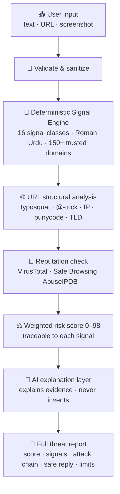

<!-- ═══════════════════════════════════════════════════════════════════════ -->
<!--                              HERO BANNER                                 -->
<!-- ═══════════════════════════════════════════════════════════════════════ -->

<div align="center">


<a href="https://myscamshield-ai.netlify.app">
  
</a>

<br/><br/>

[](https://myscamshield-ai.netlify.app)
[](https://kiro.dev)
[](LICENSE)

<br/>


<br/>

**[🌐 Live App](https://myscamshield-ai.netlify.app)** ·
**[📋 Requirements](.kiro/specs/requirements.md)** ·
**[🏗️ Design](.kiro/specs/design.md)** ·
**[🚀 Deploy Guide](DEPLOY.md)**

</div>

---

## 🛡️ What is ScamShield AI?

> **Don't just detect the scam — understand it.**

**ScamShield AI** turns a suspicious **message, screenshot, or link** into a full, structured, **explainable threat report** in seconds — calibrated for the **Pakistani market** (banks, mobile wallets, NADRA/CNIC, BISP/Ehsaas, telecom) in **English + Roman Urdu**.

Unlike generic spam filters that just say *"likely spam"* and stop:

<table>
<tr>
<td width="50%">

**❌ Ordinary spam filter**
- "Likely spam" — no reason
- Black box score
- Can't explain itself
- Guesses even with no evidence

</td>
<td width="50%">

**✅ ScamShield AI**
- Shows the **exact phrases** that triggered the alert
- **Deterministic** score traceable to each signal
- Explains **why** each signal is dangerous
- Returns an honest **"Unknown"** when evidence is thin

</td>
</tr>
</table>

> 🏆 Built as a solo submission for the **Build with Kiro 2026 Hackathon** using Kiro's spec-driven workflow.

---

## 🇵🇰 Pakistan Market Coverage

<div align="center">

| 🏦 Banks | 💳 Wallets | 🏛️ Government | 📡 Telecom | 🛒 E-Commerce |
|:---:|:---:|:---:|:---:|:---:|
| HBL, MCB, UBL | JazzCash | NADRA · FBR | Jazz · Telenor | Daraz |
| Meezan, ABL | EasyPaisa | SBP · PTA | Zong · Ufone | OLX PK |
| Alfalah, Faysal | NayaPay, SadaPay | BISP · Ehsaas | | |

</div>

**Unique Pakistani signal classes**

🪪 **CNIC / NADRA theft** &nbsp;·&nbsp; 💰 **BISP / Ehsaas welfare scam (8171 spoofing)** &nbsp;·&nbsp; 📱 **JazzCash / EasyPaisa OTP theft** &nbsp;·&nbsp; 📲 **WhatsApp / +92 redirect detection**

---

## ✨ Features

| | Feature | What it does |
|:---:|---|---|
| 📊 | **Risk Score 0–98** | Deterministic, weighted, **traceable to signals** — never random |
| 🔍 | **Signal Evidence** | Literal quotes from the message shown as proof |
| 🌐 | **URL Analysis** | Structural checks + **typosquat / homoglyph** (`paypa1`, `faceb00k`) + **`@`-host spoof** + IP hosting + punycode |
| 🪪 | **CNIC / Wallet / Gov** | NADRA theft, JazzCash/EasyPaisa OTP, BISP/Ehsaas/FBR impersonation |
| 📷 | **Screenshot OCR** | AI vision **reads text directly from screenshots** and scores it |
| 🤖 | **Evidence-First AI** | AI explains the evidence — **bound to the heuristic score, cannot hallucinate** |
| 🛡️ | **Reputation Intel** | VirusTotal · Google Safe Browsing · AbuseIPDB (optional, honest states) |
| 💬 | **Safe Reply** | A ready reply that shares **zero** sensitive info |
| ⚠️ | **Honest Limitations** | Every report lists what was **not** checked |
| 🔐 | **Full Auth** | Email + Password, **clickable email verification**, OTP, **Google OAuth** |
| 📈 | **Dashboard** | Per-account charts, history, risk distribution |

---

## 🔬 How It Works



> **The fundamental rule:** the AI **explains** structured evidence — it does **not** generate verdicts. Screenshots are read by an AI vision model (OCR), then scored by the same deterministic engine used for pasted text.

---

## 🧱 Tech Stack

<div align="center">

| Layer | Technology |
|---|---|
| **Frontend** | React 18 · TypeScript · Vite 5 |
| **Styling / UX** | Tailwind CSS 3 · Glassmorphism · Framer Motion |
| **3D / WebGL** | Three.js · @react-three/fiber (animated globe + shield scene) |
| **Charts** | Recharts |
| **Backend** | Node.js 20 · Express 4 (Netlify Function via `serverless-http`) |
| **Database** | **Turso (libSQL)** — durable serverless SQL; embedded file for local dev |
| **Auth** | HMAC-SHA256 JWT · scrypt · OTP · clickable email verification · Google OAuth (CSRF-safe) |
| **Email** | **Brevo** transactional API |
| **AI / Vision** | Any OpenAI-compatible endpoint (**Groq** free vision model for OCR) |
| **Hosting** | **Netlify** (SPA + serverless API on one domain) |
| **Testing** | Node.js built-in `node:test` — **89 passing tests** |

</div>

---

## 🚀 Quick Start

> **Requires Node.js ≥ 20**

```bash
# 1 · Clone
git clone https://github.com/asifnawaz23/ScamShield-AI.git
cd ScamShield-AI

# 2 · Install everything (root + server + client)
npm run setup

# 3 · Configure
cp .env.example .env
#   • Set a JWT_SECRET (any 32+ random chars in dev)
#   • Leave TURSO_* blank → uses an embedded local libSQL file
#   • Leave BREVO_API_KEY blank → verification links print to the console
#   • Leave AI_API_KEY blank → deterministic DEMO mode (no key needed)

# 4 · Run both servers
npm run dev
#   API → http://localhost:3001
#   Web → http://localhost:5173
```

---

## 🔑 Environment Variables

See [`.env.example`](.env.example) for the full list. Highlights:

| Variable | Scope | Purpose |
|---|:---:|---|
| `JWT_SECRET` | 🔴 **Required** | ≥32-char secret. Server **refuses to start** in production with a placeholder |
| `TURSO_DATABASE_URL` + `TURSO_AUTH_TOKEN` | Prod | Durable Turso DB (local dev uses a file automatically) |
| `BREVO_API_KEY` + `EMAIL_FROM` | Prod | Transactional email — OTP + verification links |
| `APP_PUBLIC_URL` · `CORS_ORIGIN` | Prod | Your Netlify URL |
| `GOOGLE_CLIENT_ID` + `GOOGLE_CLIENT_SECRET` + `GOOGLE_REDIRECT_URI` | Optional | Google OAuth sign-in |
| `AI_API_KEY` + `AI_BASE_URL` + `AI_MODEL` | Optional | AI explanations + screenshot OCR (e.g. Groq) |
| `VIRUSTOTAL_API_KEY` · `GOOGLE_SAFE_BROWSING_API_KEY` · `ABUSEIPDB_API_KEY` | Optional | URL/IP reputation |

> 🔒 All secrets are **server-side only** — never `VITE_`-prefixed, never committed.

---

## 🧪 Testing

```bash
npm test                 # full suite — 89 tests
npm run test:engine      # heuristic detection engine
npm run test:api         # API + security/auth integration
npm run test:reputation  # reputation service
```

Covers scam detection quality (typosquat, `@`-trick, card/CVV theft), **security** (IDOR, cross-user delete, JWT guard, OAuth state), and the **email-verification token lifecycle** (single-use, expiry, reuse rejection).

---

## ☁️ Deployment

**One Netlify site runs everything** — the React SPA and the Express API (a Netlify Function) share the same domain, so there's no CORS or separate backend host.

```
Netlify site ──► client/dist            (static SPA)
             └─► /.netlify/functions/api  (Express via serverless-http)
                     ├─► Turso (libSQL)    durable database
                     ├─► Brevo             transactional email
                     └─► Groq / OpenAI     AI explanations + OCR
```

Step-by-step (Turso + Brevo + Google OAuth + env vars) in **[`DEPLOY.md`](DEPLOY.md)**.

---

## 🔐 Security & Privacy

- 🛡️ **Ownership-enforced history** — a user can only read/delete their **own** analyses (IDOR-safe)
- 🔑 **JWT** signed with a required strong secret; **CSRF-validated** Google OAuth
- 🔒 **CORS locked down** in production; secrets are environment-only
- 🕵️ **Privacy** — the full original message is **not stored**; only a short summary, the report, and metadata
- ✋ AI is instructed to **never accuse the sender** or provide attack instructions
- ⚠️ Every report includes explicit **uncertainty & limitation** disclosures

---

## 🧭 Kiro Spec-Driven Workflow

```
.kiro/specs/
├── requirements.md   ← user stories + acceptance criteria
├── design.md         ← architecture, scoring, AI design, security
└── tasks.md          ← implementation checklist
```

The specs reflect the genuine development process — not retroactive documentation.

---

## ⚠️ Known Limitations

- URL checker inspects **structure only** — it never opens or crawls the target
- Screenshot OCR quality depends on the configured AI vision model; with no key it honestly reports **"not assessed"** (never a fake "safe")
- Reputation APIs are optional — without keys, status is honestly **"not configured"**
- Pattern-based scoring — very short or novel messages may have lower confidence
- Assessment is **probabilistic** — not a legal verdict about sender intent

---

<div align="center">

## 👤 Author

**Muhammad Asif Nawaz** &nbsp;·&nbsp; Full-Stack Developer · AI Enthusiast

[](https://github.com/asifnawaz23)
[](mailto:masifnawaz815@gmail.com)

<br/>


⭐ **Star this repo if ScamShield AI helped you understand a threat.**

</div>
